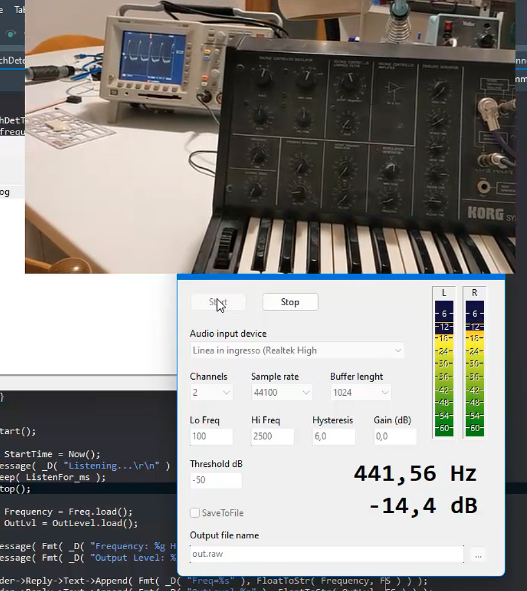

# PitchDetactor
Pitch detector using bit-stream autocorrelation

## Rationale
A VCL project for accurately measuring the frequency of notes consisting of signals with complex/problematic frequency spectrum.
This project uses Joel de Guzman's excellent header-only library for fast and efficient tone recognition (q) using bit-stream autocorrelation. Joel is a well-known guru in the C++ community for his creative support to boost libraries.

It can reliably detect tones in complex, rather noisy signals with varying duty-cycles full of harmonics even at pretty low-level intensity (up to -60 dB).

The input test procedure (interactive detection):

Server mode detection:

## Getting Started

### Prerequisites / Dependencies

It depends on Ethea's TSVGIconImageList component which you can download with GetIt or from this link:

https://github.com/EtheaDev/SVGIconImageList

Also, it strongly depends on 'q' library from https://github.com/cycfi/q. Since C++ Builder does not support concepts, it necessary to use the 440c297b8fc784f65536f00afbe64d8a7bce4a1d checkout of 'q' which works with C++17.  

Clone the repository using the following command:

git clone --recurse-submodules https://github.com/gcardi/PitchDetector.git

If necessary, manually add the 'q' submodule:

git submodule add https://github.com/cycfi/q.git

Then update the submodules of 'q':

cd q
git submodule update --init --recursive

It's important to set 'q' library to commit 440c297b8fc784f65536f00afbe64d8a7bce4a1d as C++Builder doesn't support concepts.

git update-index --cacheinfo 160000,440c297b8fc784f65536f00afbe64d8a7bce4a1d,q
